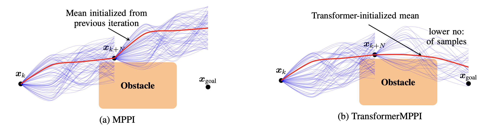

# Transformer based Model Predictive Path Integral Control (TransformerMPPI)



This repository contains code accompanying the manuscript titled ["Transformer-based Model Predictive Path Integral Control"](https://arxiv.org/abs/2412.17118)

## Abstract

This project presents a novel approach to improve the Model Predictive Path Integral (MPPI) control by using a transformer to initialize the mean control sequence. Traditional MPPI methods often struggle with sample efficiency and computational costs due to suboptimal initial rollouts. We propose TransformerMPPI, which uses a transformer trained on historical control data to generate informed initial mean control sequences. TransformerMPPI combines the strengths of the attention mechanism in transformers and sampling-based control, leading to improved computational performance and sample efficiency. The ability of the transformer to capture long-horizon patterns in optimal control sequences allows TransformerMPPI to start from a more informed control sequence, reducing the number of samples required, and accelerating convergence to optimal control sequence.

## Installation

First install the required dependencies by running the following command:

```bash
pip3 install -U pip
pip3 install --upgrade torch torchvision torchaudio
pip3 install -upgrade -r requirements.txt
```

Then install the transformer-mppi package by running the following command:

```bash
git clone https://github.com/shrenikvz/transformer-mppi.git
cd transformer-mppi
pip3 install -e .
```

## **🚨 This repository is currently unstable and under active development 🚨**

## Citation

```bibtex
@article{zinage2024transformer,
  title={Transformer-Based Model Predictive Path Integral Control},
  author={Zinage, Shrenik and Zinage, Vrushabh and Bakolas, Efstathios},
  journal={arXiv preprint arXiv:2412.17118},
  year={2024}
}
```


