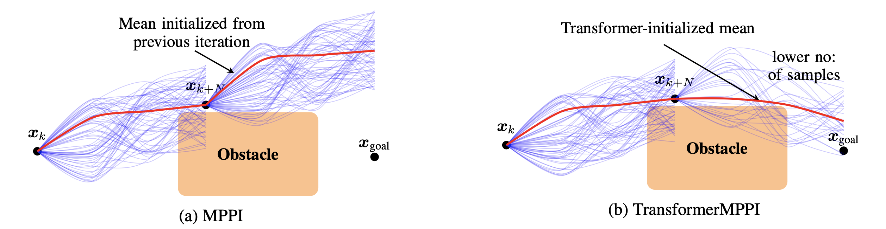

# Transformer-MPPI

Installable package and reproducible pipeline for **Transformer-based Model Predictive Path Integral (MPPI) control**.



This repo provides:
- A reusable Python package API.
- End-to-end data generation, training, and benchmarking pipelines.
- Reproduction outputs (CSV metrics) aligned with the manuscript protocol.
- A `quick` profile for practical local runs and a `paper` profile for full-scale settings.

## Installation

```bash
pip install -e .
```

For NVIDIA GPU execution, install a JAX build that matches your CUDA runtime before running the package.

## Package usage

Distribution name is `transformer-mppi`; Python import path uses underscore:

```python
from transformer_mppi import TransformerMPPIController
```

### Loading a trained controller

```python
import jax.numpy as jnp
from transformer_mppi import TransformerMPPIController

controller = TransformerMPPIController.from_checkpoint(
    checkpoint_dir="artifacts/racing/checkpoints/racing_quick",
    dim_state=4,
    dim_control=2,
    dynamics=my_dynamics_fn,
    cost_func=my_cost_fn,
    u_min=jnp.array([-2.0, -0.25]),
    u_max=jnp.array([2.0, 0.25]),
    sigmas=jnp.array([1.0, 1.0]),
)
```

## Reproducible pipeline

Run both tasks:

```bash
python -m transformer_mppi.cli reproduce --task both --profile quick --circuit-csv circuit.csv --output-dir artifacts
```

Run one task:

```bash
python -m transformer_mppi.cli reproduce --task navigation2d --profile quick --output-dir artifacts
python -m transformer_mppi.cli reproduce --task racing --profile quick --circuit-csv circuit.csv --output-dir artifacts
```

## Output structure

For each task (`navigation2d`, `racing`) under `output-dir`:
- `checkpoints/<task>_<profile>/`
  - `model.pt`
  - `metadata.json`
  - `input_scaler.pkl`
  - `output_scaler.pkl`
- `csv/`
  - Sample-sweep and dynamic-obstacle benchmark CSVs
  - Transformer prediction CSVs (`*_u1.csv`, `*_u2.csv`)
- `training_history.csv`

## Profiles

- `quick`: reduced training workload for fast iteration; retains paper protocol structure and trend-oriented comparisons.
- `paper`: full experiment scale from manuscript tables (long runtime).

## Citation

If you use this codebase in your research, please cite the paper:

- [Transformer-Based Model Predictive Path Integral Control (arXiv:2412.17118)](https://arxiv.org/abs/2412.17118)

```bibtex
@article{zinage2024transformer,
  title={Transformer-Based Model Predictive Path Integral Control},
  author={Zinage, Shrenik and Zinage, Vrushabh and Bakolas, Efstathios},
  journal={arXiv preprint arXiv:2412.17118},
  year={2024}
}
```
